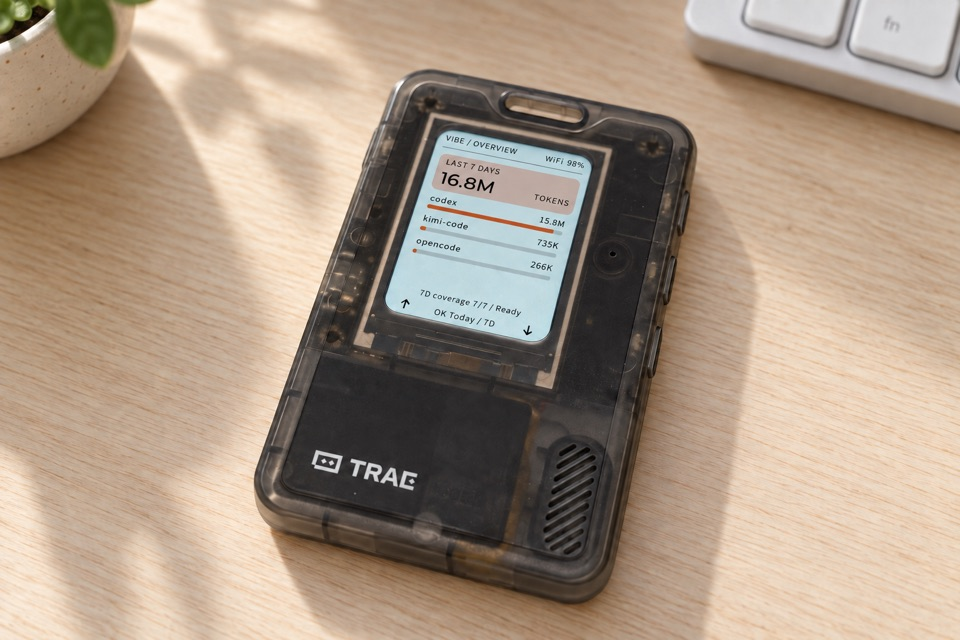
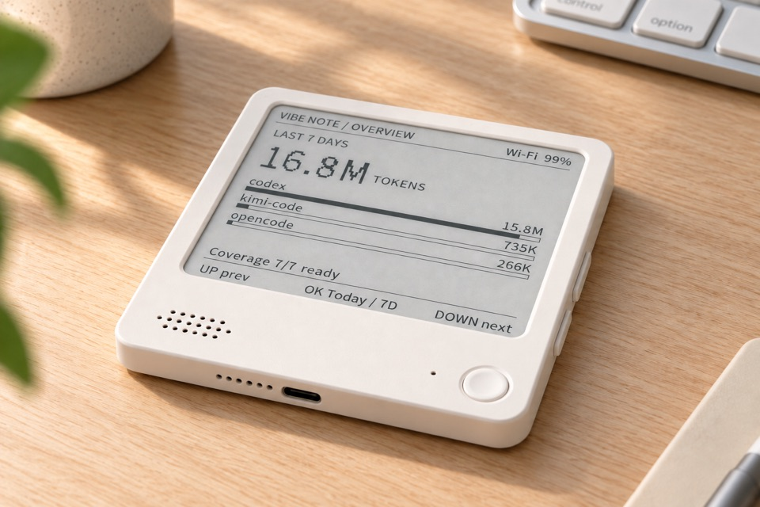

<p align="right">
  <a href="README.zh_CN.md">简体中文</a> · <strong>English</strong>
</p>

# vibe-usage-esp32

Open-source ESP-IDF firmware that shows Vibe Usage directly on two small
desktop products: **Vibe Passport** (FoloToy AI Passport hardware) and
**Vibe Note** (black-and-white ZECTRIX NOTE4 hardware). The device performs Vibe Device Flow in a browser, calls the HTTPS Usage
API itself, and never needs a personal API key compiled into the firmware.

Current product version: **0.0.1**, maintained in [`VERSION`](VERSION).
Repository: [talisk/vibe-usage-esp32](https://github.com/talisk/vibe-usage-esp32).
Author: [SwainTalisk](https://x.com/SwainTalisk).
Both Settings menus use **VibeCafe** for account linking. About displays the
product name, version, full repository URL and author URL. Passport uses inset
↑ / ↓ footer arrows and a rounded surface with black outer corners.

| Vibe Passport | Vibe Note |
| :---: | :---: |
| <a href="docs/images/vibe-passport-en.jpg"></a> | <a href="docs/images/vibe-note-en.jpg"></a> |

Product showcase images supplied by the project author; click to enlarge.

> [!IMPORTANT]
> This is an independent community project. It is not an official Vibe,
> FoloToy, or ZECTRIX product. Only the 400 × 300 black-and-white NOTE4 is
> supported; NOTE4C is not compatible.

## What it provides

- Today and rolling seven-day token totals with per-source ranking.
- Exact unsigned 64-bit aggregation of API `totalTokens`; no floating-point
  conversion and no silent saturation.
- Streaming, bounded JSON parsing with fail-closed pagination detection.
- Device Flow QR + matching user code; the API key never reaches the UI.
- Up to ten saved 2.4 GHz Wi-Fi networks, including active hidden-SSID
  fallback and strongest-AP selection.
- CRC-protected, account/timezone-isolated eight-day Last Known Good cache.
- Persisted `Retry-After`, serialized network work, cancellation generations,
  and resumable local factory reset.
- Passport LVGL UI with 30-second backlight dimming.
- NOTE4 e-paper UI with full/partial refresh policy and DOWN-hold shutdown.
- Reproducible dual-firmware build, protected-layout verifier, release
  manifest, checksums, and SPDX inventory.

The displayed metric is `API_TOTAL_V1`: the checked sum of every returned
bucket's `totalTokens`. It can differ from the desktop app when the app adds
cached-input tokens. See [the frozen API contract](docs/api-contract.md).

## Supported hardware

Learn about the original hardware: [FoloToy AI Passport development resources](https://github.com/folotoy/ai-passport)
for Vibe Passport, and [ZECTRIX NOTE specifications](https://wiki.zectrix.com/zh/hardware/note/spec)
for Vibe Note. These upstream links describe the hardware, not this community firmware.

| Device | Target | Display | Flash | Default refresh | Status source |
| --- | --- | --- | --- | --- | --- |
| FoloToy AI Passport | ESP32-C3 | ST7789, 240 × 320 | 8 MB, no PSRAM | 15 min | [Acceptance record](docs/acceptance/2026-09-05-product-branding.md) |
| ZECTRIX NOTE4 BLACK-WHITE | ESP32-S3 | SSD2683, 400 × 300 | 16 MB, 8 MB octal PSRAM | 30 min | [Acceptance record](docs/acceptance/2026-09-05-product-branding.md) |

Build, host, API-contract, device, installer, and power claims are tracked
separately. A successful build is never presented as hardware validation.

## Quick start from source

Install ESP-IDF 5.5.3 and activate its environment, then run:

```bash
./tools/validate.sh --static
./tools/build.sh all
```

Build only one target with `./tools/build.sh passport` or
`./tools/build.sh note4`. The build tool uses isolated sdkconfig files and
verifies the chip, flash size, app boundary, partition table MD5, merged image,
and Passport protected regions.

Do not use `erase-flash`. Read the [installation and recovery guide](docs/installation.md)
before writing either board. Passport identity data at `0x356000` and permanent
Recovery at `0x700000` are factory-owned and must never be overwritten.

## First use

### One-prompt flashing with a coding agent

The repository includes [`.agents/skills/flash-firmware`](.agents/skills/flash-firmware/SKILL.md).
With ESP-IDF 5.5.3 installed and a supported device connected, ask a skill-capable
coding agent:

> Use $flash-firmware to build, verify and flash my connected Vibe Passport.

Replace the product with Vibe Note, or explicitly request both. For a preview
without writing, ask for a dry run. The skill resolves current ports, reuses the
verified segmented installer and preserves saved Wi-Fi/account/settings. It
stops for ambiguous targets, missing prerequisites or failed checks.

### Connect and link your account

1. Power the device. With no saved Wi-Fi, it displays a unique
   `VibePassport-XXXX` or `VibeNote-XXXX` hotspot.
2. Connect a phone to that open setup hotspot and visit
   `http://192.168.4.1` if the captive page does not open automatically.
3. Select or enter a 2.4 GHz network. The setup window closes after ten
   minutes.
4. Restore the phone's internet connection, scan the Vibe authorization QR,
   verify the matching code, and approve access.
5. The device fetches Today, then fills the remaining seven-day window one
   calendar day at a time.

The P0 setup hotspot is intentionally open and uses local HTTP. Use it only
while physically present; Wi-Fi credentials are not protected over that local
link. The portal never asks for a Vibe password or API key.
Both the setup and success pages show the product name, version, repository,
author, and Wi-Fi-only setup/security boundary, in the selected language.

## Controls

| Input | Normal screens | Other behavior |
| --- | --- | --- |
| UP / DOWN click | Change page or selection | Toggle confirmation choice |
| OK click | Toggle Today / 7D or select | Retry the current setup/error step |
| OK hold | Open/close Settings | Hold for 2 seconds during boot to reopen Wi-Fi setup |
| NOTE4 DOWN hold | — | After 3 seconds, stop network work, clear the panel, and release the power latch |

Settings include refresh now, seven-day reconciliation, Wi-Fi reconfigure,
link/unlink, timezone, display refresh/brightness, About, **Reset Settings**,
and **Language**. Hold OK, select Language with UP/DOWN, then click OK to cycle
English → 简体中文 → 繁體中文 → 日本語 → English. English is the default;
the choice is saved across reboot and also sets the next portal's language.
Changing language does not clear Wi-Fi, account authorization, or usage data.
Reset Settings still requires confirmation and removes local settings,
Wi-Fi credentials, account authorization, and cache.

In About, click UP to show the Repository QR code or DOWN to show the author's
X QR code. Click OK to return to About, then OK again to return to Settings.
QR titles and the "Scan to visit." hint follow the selected language.

Built-in Latin and CJK screen text share one Noto Sans face and alphabetic
baseline, preserving glyph proportions without per-character centering or
cropping. Note uses a 50% monochrome coverage threshold for balanced strokes.
Product/source names,
URLs, protocol codes, and timezone identifiers are not translated. Arbitrary
user-supplied Unicode names are not covered by the built-in UI font subset.
See `docs/upstream-lock.md` for font licensing and regeneration.

On Agents, UP/DOWN scroll through sources before moving to the adjacent page
at a list edge. Changing Today/7D returns to the first source.

## Repository layout

```text
components/vibe_usage/       Shared HTTPS, parser, aggregation, cache, store
components/app_controller/   Serialized product lifecycle and retry policy
components/wifi_adapter/     Product wrapper for the vendored Wi-Fi component
components/esp_wifi_connect/ Audited captive portal and station implementation
firmware/ai-passport/        ESP32-C3 + LVGL target
firmware/zectrix/            ESP32-S3 + SSD2683 target
tests/                       Host tests and sanitized contract fixtures
tools/                       Build, validation, layout, and release tooling
docs/                        Architecture, contracts, safety, and acceptance
```

Architecture and invariants are documented in
[`docs/architecture.md`](docs/architecture.md). Pinned upstream commits and
local changes are in [`docs/upstream-lock.md`](docs/upstream-lock.md).

## Validation and releases

```bash
./tools/validate.sh --static
./tools/validate.sh --firmware
./tools/validate.sh
./tools/release.sh 0.0.1
```

The complete gate runs sanitized host tests, repository/privacy checks, clean
ESP-IDF builds for both chips, stack-frame budgets, app-size checks, and merged
layout verification. Hardware-only checks remain explicit in the acceptance
record.

After resolving both boards' dependencies with firmware builds, run
`./tools/test-ui-layout.sh` for real LVGL font-width, bounded-label and both
boards' QR pixel checks.
For an isolated single-board checkout, use `./tools/test-ui-layout.sh passport`
or `./tools/test-ui-layout.sh note4`; only that board's dependencies are required.
The firmware validation gate includes this test; it does not replace screen
photos from the physical boards.

Version 0.1.1 fixes local-day API boundaries and rebuilds the usage cache;
saved Wi-Fi and authorization are retained. With an existing local Vibe CLI
configuration, an optional read-only seven-day API/core reconciliation is:

```bash
python3 tools/probe_live_usage.py --config /path/to/existing/config.json
```

The probe keeps credentials, responses, and totals in memory and prints only
PASS/FAIL metadata. It does not provision a board or verify its physical screen.

## Security and privacy

- TLS uses the ESP certificate bundle with hostname and validity checks;
  redirects are disabled and Bearer credentials are restricted to the trusted
  origin.
- Credentials and raw Usage responses are never logged or stored as fixtures.
- NVS is plaintext on these P0 builds. Logical unlink cannot promise forensic
  erasure of old flash pages. Revoke Vibe access separately before losing or
  transferring a device.
- Secure Boot, Flash Encryption, eFuse writes, custom OTA, and deep-sleep
  scheduling are intentionally outside the validated P0 feature set.

Please report vulnerabilities using [SECURITY.md](SECURITY.md), not a public
issue.

## Contributing

See [CONTRIBUTING.md](CONTRIBUTING.md) and [AGENTS.md](AGENTS.md). All changes
must preserve the Passport recovery contract and keep host, firmware, device,
installer, and power evidence distinct.

## License

Project-owned code is available under the [MIT License](LICENSE). Vendored and
managed dependencies retain their own terms; see
[THIRD_PARTY_NOTICES.md](THIRD_PARTY_NOTICES.md).
