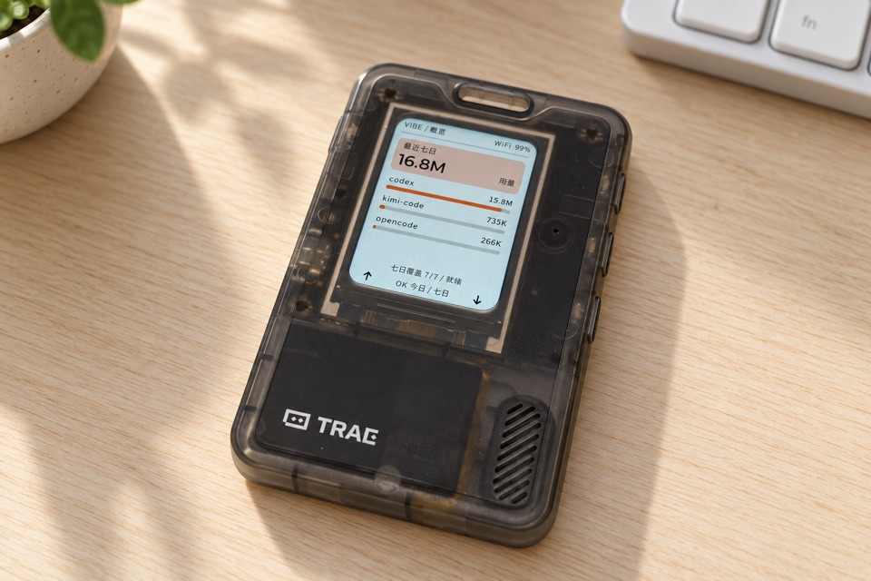
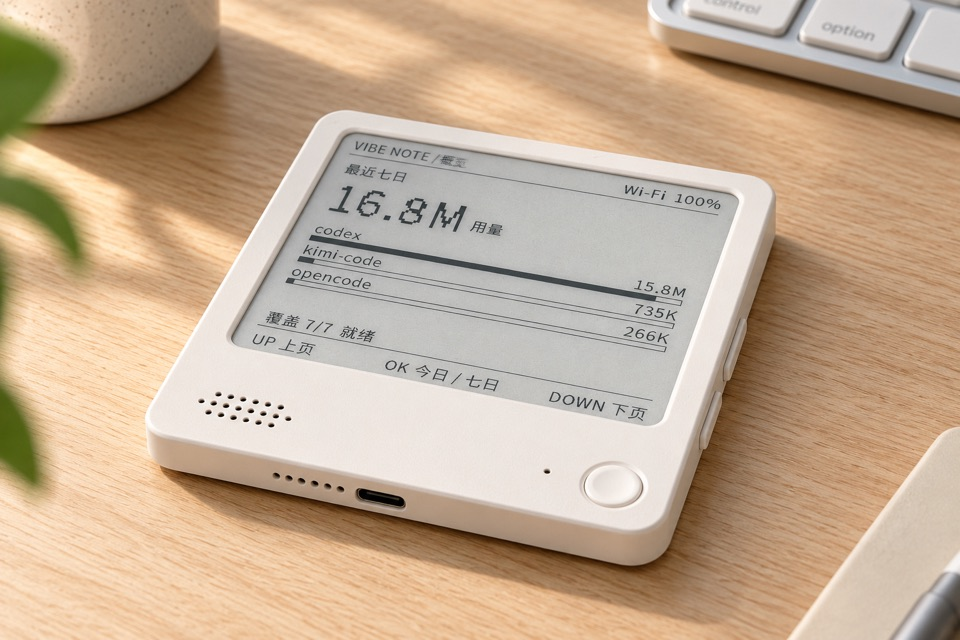

<p align="right">
  <strong>简体中文</strong> · <a href="README.md">English</a>
</p>

# vibe-usage-esp32

这是一个开源 ESP-IDF 固件项目，两个正式产品分别为 **Vibe Passport**（FoloToy
AI Passport 硬件）和 **Vibe Note**（黑白版 ZECTRIX NOTE4 硬件），直接显示
Vibe Usage。设备通过浏览器完成 Vibe Device Flow，自行调用
HTTPS Usage API；固件中不内置个人 API Key。

当前产品版本为 **0.0.1**，统一维护在 [`VERSION`](VERSION) 中。
仓库：[talisk/vibe-usage-esp32](https://github.com/talisk/vibe-usage-esp32)。
作者：[SwainTalisk](https://x.com/SwainTalisk)。两个 Settings 菜单均使用
**VibeCafe** 作为账号入口；About 展示产品名、版本、完整仓库与作者链接。
Passport 使用向内收的 ↑ / ↓ 页脚箭头，圆角外侧为黑色。

| Vibe Passport | Vibe Note |
| :---: | :---: |
| <a href="docs/images/vibe-passport-zh.jpg"></a> | <a href="docs/images/vibe-note-zh.jpg"></a> |

产品展示图由项目作者提供，可点击放大。

> [!IMPORTANT]
> 本项目是独立社区项目，不代表 Vibe、FoloToy 或 ZECTRIX 官方。NOTE4 仅支持
> 400 × 300 黑白墨水屏版本，不兼容 NOTE4C。

## 功能

- Today / 最近 7 天 Token 总量与来源排行。
- 对 API `totalTokens` 做精确无符号 64 位求和，不经过浮点数。
- 流式、有界 JSON 解析；遇到未知分页、半包、超限或 schema 错误时拒绝候选，
  保留 Last Known Good。
- Device Flow 授权二维码与 user code；API Key 不进入 UI。
- 最多保存 10 组 2.4 GHz Wi‑Fi，支持隐藏 SSID 主动回退与同名 AP 强信号选择。
- 带 CRC、账号 generation 和时区隔离的 8 日 A/B 缓存。
- 持久化 `Retry-After`、串行网络 worker、异步取消与可续跑 Factory Reset。
- Passport LVGL 界面与 30 秒降背光；NOTE4 全刷/局刷策略与长按关机。
- 双目标干净构建、Passport 保护区校验、Release manifest、SHA-256 与 SPDX 清单。

屏幕口径固定为 `API_TOTAL_V1`，即所有 bucket 的 `totalTokens` 安全求和。当桌面
App 额外计入 cached input 时，两者可能不同。详见
[API 契约](docs/api-contract.md)。

## 支持硬件

了解两款产品的原始硬件：Vibe Passport 对应
[FoloToy AI Passport 开发资源](https://github.com/folotoy/ai-passport)，Vibe Note 对应
[ZECTRIX NOTE 硬件规格](https://wiki.zectrix.com/zh/hardware/note/spec)。
这些上游链接介绍硬件本身，不代表本社区固件。

| 设备 | 芯片 | 屏幕 | Flash | 默认刷新 |
| --- | --- | --- | --- | --- |
| FoloToy AI Passport | ESP32-C3 | ST7789，240 × 320 | 8 MB，无 PSRAM | 15 分钟 |
| ZECTRIX NOTE4 BLACK-WHITE | ESP32-S3 | SSD2683，400 × 300 | 16 MB，8 MB 八线 PSRAM | 30 分钟 |

实际通过项和未测项见
[最新验收记录](docs/acceptance/2026-09-05-product-branding.md)。Build、Host tests、
真实 API、真机、安装器和电源证据始终分开记录，不用编译成功代替真机通过。

## 从源码构建

安装并激活 ESP-IDF 5.5.3：

```bash
./tools/validate.sh --static
./tools/build.sh all
```

也可只构建 `passport` 或 `note4`。构建工具使用独立 sdkconfig，并检查芯片、
Flash、3 MiB app 边界、分区表 MD5、merged 镜像和 Passport 保护区。

严禁使用 `erase-flash`。刷写前必须阅读
[安装与恢复说明](docs/installation.md)。Passport 的 `cardid@0x356000` 和永久
`Recovery@0x700000` 属于出厂数据，本项目永不写入。

## 首次使用

### 通过 Coding Agent 一句话刷机

仓库内置 [`.agents/skills/flash-firmware`](.agents/skills/flash-firmware/SKILL.md)。
安装 ESP-IDF 5.5.3 并连接支持的设备后，可以对支持 skill 的 Coding Agent 说：

> 使用 $flash-firmware 构建、验证并烧录已连接的 Vibe Passport。

也可指定 Vibe Note，或明确要求烧录两个设备。只想预览时，要求 dry run，不写设备。
Skill 会重新识别串口、复用带校验的分段安装器，并保留 Wi-Fi、账号和设置；
目标不明确、环境缺失或检查失败时停止，不会自动擦除设备。

### 配网与账号关联

1. 无已保存 Wi‑Fi 时，设备显示 `VibePassport-XXXX` 或
   `VibeNote-XXXX` 热点。
2. 手机连接该开放热点；若系统未自动弹窗，访问 `http://192.168.4.1`。
3. 选择或填写 2.4 GHz Wi‑Fi。配网窗口 10 分钟后自动关闭。
4. 让手机恢复家庭 Wi‑Fi/蜂窝网络，扫描 Vibe 授权二维码，核对 user code 后批准。
5. 设备先获取 Today，再逐日补齐最近 7 天。

P0 配网热点为开放 AP，且本地链路使用 HTTP。请只在物理在场时开启；该链路不对
Wi‑Fi 密码提供传输加密。Portal 永远不会收集 Vibe 密码或 API Key。
配网页和成功页均显示产品名、版本、仓库、作者及配网安全说明，跟随页面所选语言。

## 按键

| 操作 | 行为 |
| --- | --- |
| UP / DOWN 单击 | 翻页、移动选项或切换确认项 |
| OK 单击 | Today / 7D 切换、选择或重试 |
| OK 长按 | 打开/关闭 Settings；开机时按住 2 秒进入重新配网 |
| NOTE4 DOWN 长按 3 秒 | 等待网络停止、清屏、关闭外设并释放电源 latch |

长按 OK 打开 Settings，用 UP/DOWN 选中 **Language**，单击 OK 依次切换
English → 简体中文 → 繁體中文 → 日本語 → English。默认英文，重启保留选择；
下一次打开配网热点时，网页默认使用设备语言。切换语言不会清除网络、账号或用量。
**Reset Settings** 仍需二次确认，会清除本地设置、Wi-Fi、账号授权及缓存。

在 About 页短按上键显示 Repository 仓库二维码，短按下键显示作者 X 二维码。
短按 OK 返回 About，再按 OK 返回设置。二维码标题与“扫码访问”提示随语言切换。

内置中英文共用 Noto Sans 字体和字母基线，保留字形比例，不再逐字居中或裁切。
Note 使用 50% 单色覆盖阈值，避免低阈值让笔画显得过粗。
产品名、来源名、网址、协议代码和时区标识不翻译，
不承诺覆盖用户自行输入的任意 Unicode 名称。字体许可和再生成方法见
`docs/upstream-lock.md`。

## 验证与发布

Agents 页的 UP/DOWN 会先滚动来源列表，到边界后再切换页面；切换 Today/7D
会回到列表开头。

```bash
./tools/validate.sh --static
./tools/validate.sh --firmware
./tools/validate.sh
./tools/release.sh 0.0.1
```

完整 gate 包含 ASan/UBSan Host tests、隐私扫描、两芯片干净构建、栈帧预算、
app 大小与固件布局检查。必须上真机的项目继续在验收记录中标为未验证。

首次构建两台设备、解析依赖后，可运行 `./tools/test-ui-layout.sh`，使用实际
LVGL 字体检查文字宽度、标签高度，以及两台设备的二维码像素。固件 gate 已包含它，但它不替代实拍验证。

0.1.1 修复本地日 API 查询边界，并重建用量缓存；保留已有 Wi-Fi 和登录授权。
已有本地 Vibe CLI 配置时，可选择执行只读七日 API/固件核心对账：

```bash
python3 tools/probe_live_usage.py --config /path/to/existing/config.json
```

该检查仅在内存中处理凭据、响应和总量，只输出 PASS/FAIL 元数据，不给设备
注入账号，也不替代物理屏幕验证。

## 安全边界

- TLS 使用 ESP certificate bundle，验证证书链、hostname 和时间，不降级 HTTP。
- 日志和 fixtures 不保存凭据或原始个人 Usage 响应。
- P0 NVS 为明文。逻辑 unlink 不能保证历史 Flash 页不可恢复；设备丢失或转让前，
  还应在 Vibe 服务侧撤销授权。
- P0 不写 eFuse，不启用 Secure Boot / Flash Encryption，不自建 OTA，也不宣称
  deep-sleep 定时运行已验证。

贡献规范见 [CONTRIBUTING.md](CONTRIBUTING.md) 与 [AGENTS.md](AGENTS.md)。
项目自有代码采用 [MIT License](LICENSE)；第三方许可见
[THIRD_PARTY_NOTICES.md](THIRD_PARTY_NOTICES.md)。
